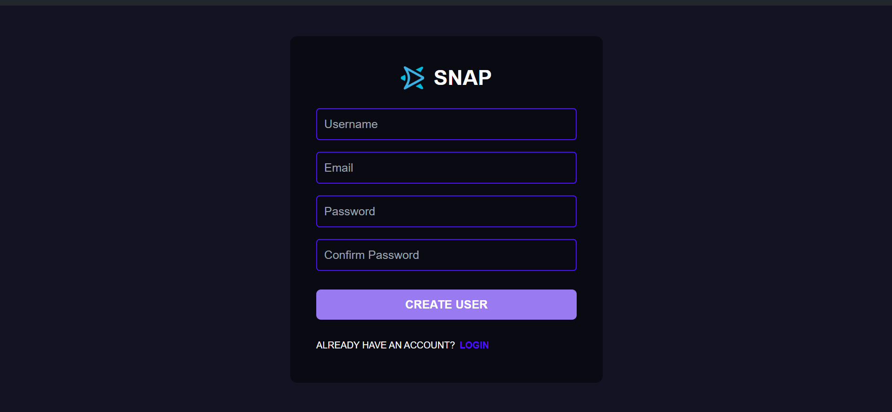
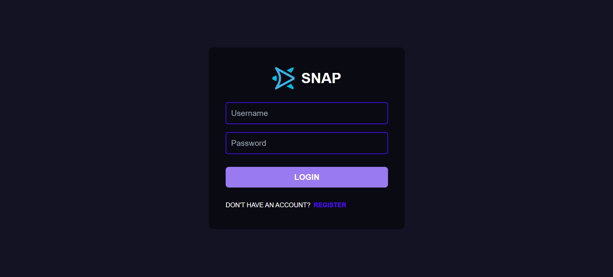
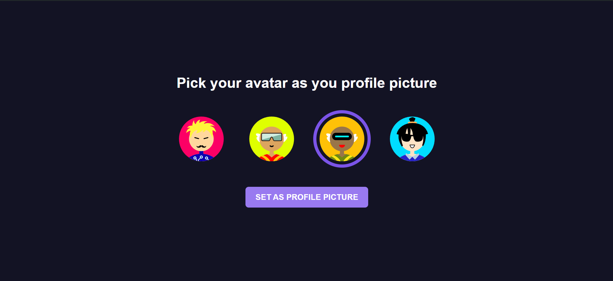
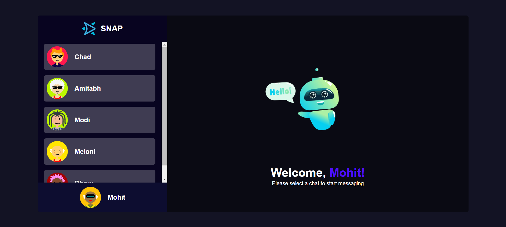

# Project Overview

 This is a multi-page chatting application made on MERN Stack. It's key features include:-
- Register and Login page for user authentication.
- Avatar setting page, where user can set their avatars.
- A chat page where users can chat with the registered users.






<br/>

# Getting Started

Fork the repository at-https://github.com/mohit-bhandari45/Chatting-Application to your account
Then clone the forked repository into your local machine

Then navigate to the cloned repository on your local system

``` 
cd Chatting-Application
```
 
### **ENV Variables**
```
MONGO_URI= Set your mongodb url in env package
example can be:-"mongodb://localhost:27017/yourdatabase_name"
```


### **Frontend and Backend run**

Navigate to the front and backend individually, install all the packages by npm i and run individual servers by running these commands in different tabs

``` 
cd Frontend
npm i
npm run dev
```

``` 
cd Backend
npm i
node --watch server.js(refresh it)
```

### Enjoy you application now!